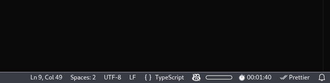
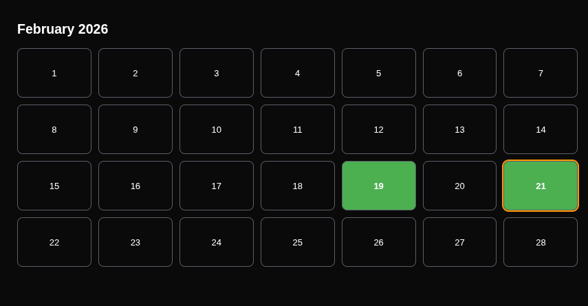
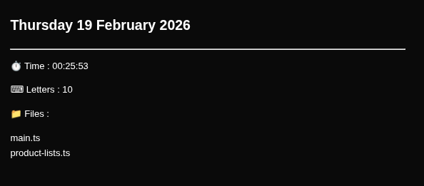

# DevStreak ⏱🔥

**DevStreak** is a VS Code extension that tracks your daily coding activity and visualizes it using a calendar-style activity dashboard.

It helps you understand **how consistently you code**, **how much time you spend in VS Code**, and **what you worked on each day**.

---

## ✨ Features

✅ **Automatic Stopwatch**

* Starts when VS Code opens.
* Continues from previous sessions.
* Resets automatically at midnight.

✅ **Daily Activity Tracking**

* Time spent coding.
* Letters typed.
* Files edited.

✅ **Activity Dashboard**

* Click the stopwatch in the status bar to open the activity tab.
* Scroll through past months.
* Active coding days are highlighted.

✅ **Detailed Daily View**
Click any date to see:

* ⏱ Coding Time
* ⌨ Letters Typed
* 📁 Files Edited

✅ **Local Storage**
All data is stored locally using VS Code storage.
No internet connection required.

---

## 📸 Screenshot

### Stopwatch


### Heatmap


### Day's Details 



---

## 🚀 Installation (Development)

Clone the repository:

```
git clone https://github.com/Alwaystanishq/devstreak.git
```

Open the folder in VS Code.

Install dependencies:

```
npm install
```

Run the extension:

```
Press F5
```

A new Extension Development Host window will open.

---

## 🧠 How It Works

* DevStreak listens to document edit events.
* Tracks typing activity and edited files.
* Stores daily records locally.
* Displays activity using a calendar dashboard.

---

## 🔒 Privacy

DevStreak does **not collect or send any data externally**.

All activity data stays on your machine.

---

## 🛠 Built With

* JavaScript
* VS Code Extension API

---

## 📄 License

MIT License

---

## ⭐ Support

If you like DevStreak:

* ⭐ Star the repository
* Share feedback or suggestions

Happy coding! 🚀
